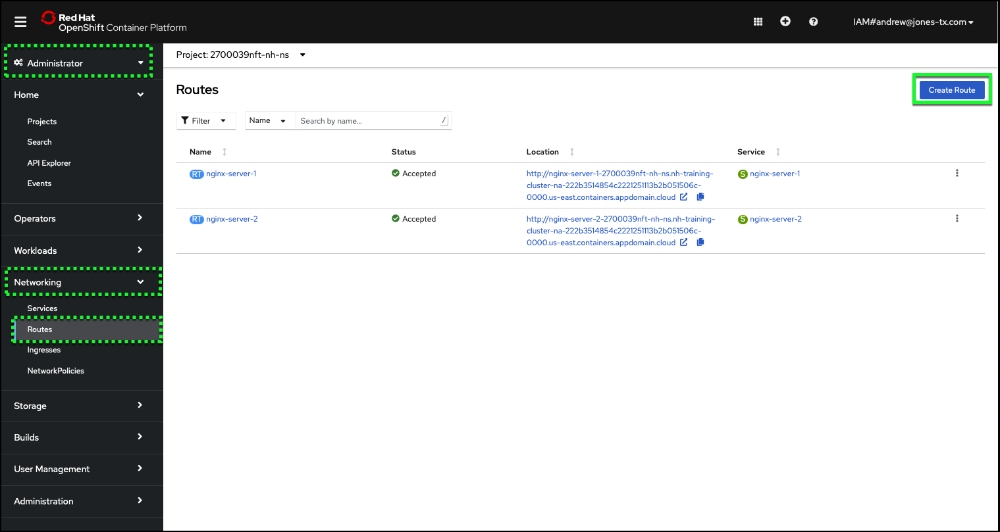
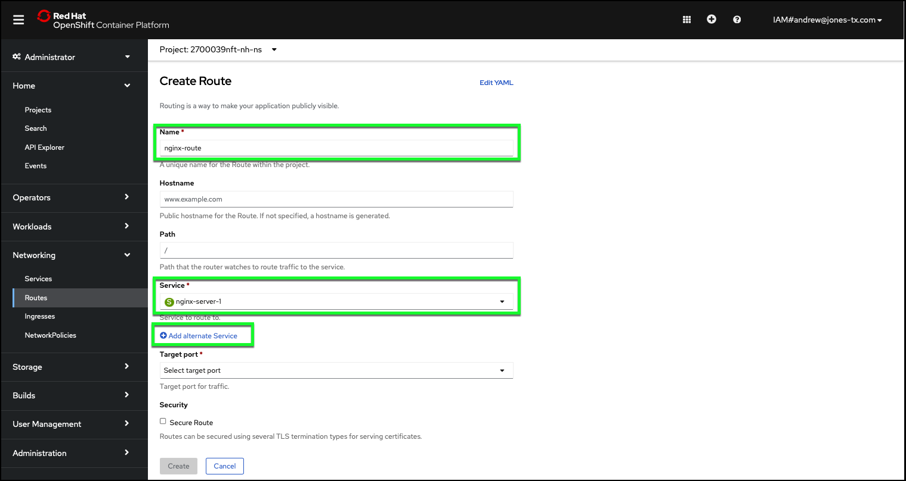
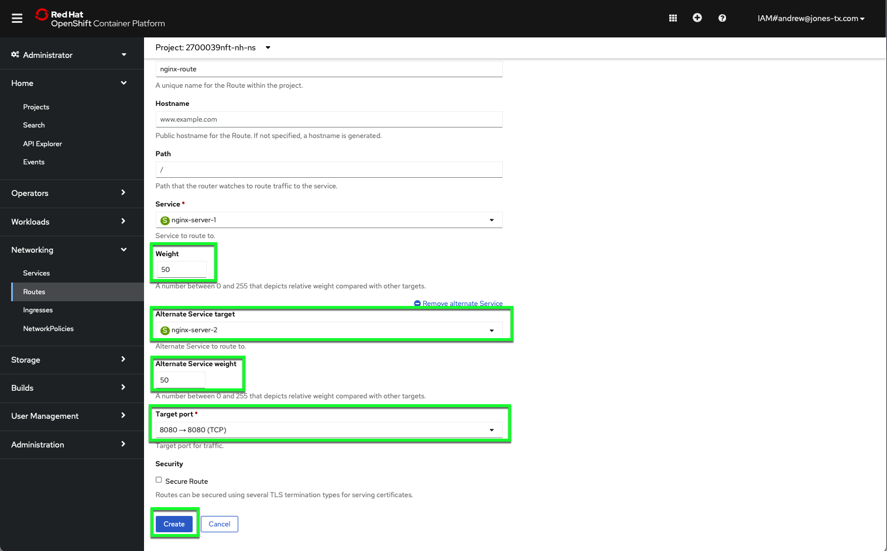
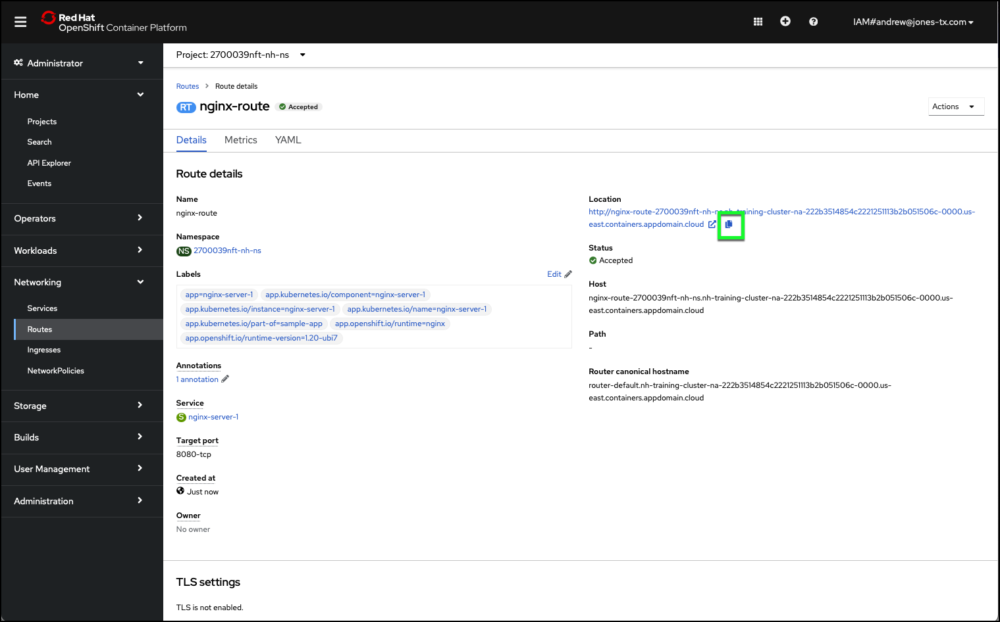

# Balancing network traffic

In this section, you will create a route to balance network traffic between our two deployed applications.

1. Change to the **Administrator** perspective.
2. Verify the **Project** selected is your project. If it is not, click the pulldown and select your project.
3. Click **Networking** in the left-hand taskbar.
4. Click **Routes** in the **Networking** sub-menu.

On this screen you can see the defaults routes that were automatically created when you deployed the NGINX container. Next, we will create a new route that will balance incoming requests to both of the NGINX servers.

5. Click **Create Route**.



6. Configure the following properties:

   Name: ```nginx-route```
   Service: **nginx-server-1**




7. Click on **+ Add Alternate Service** and update with:

   Weight: 50

   Alternative Service Target: **nginx-server-2**

   Alternative Service Weight: 50

   Target Port: 8080->8080

   

!!! warning "Make sure both the **Weight** and **Alternate Service weight** fields are set to **50**"

8. Click **Create**.

Once the route is created, your web browser will redirect to the details page of the newly created route.

9. Record the **Location** (URL) of the **nginx-route**.



The default OpenShift load balancer is used to distribute incoming requests sent to the route's **Location** URL. Be sure to copy the **Location** URL as you will use it in the next section.
