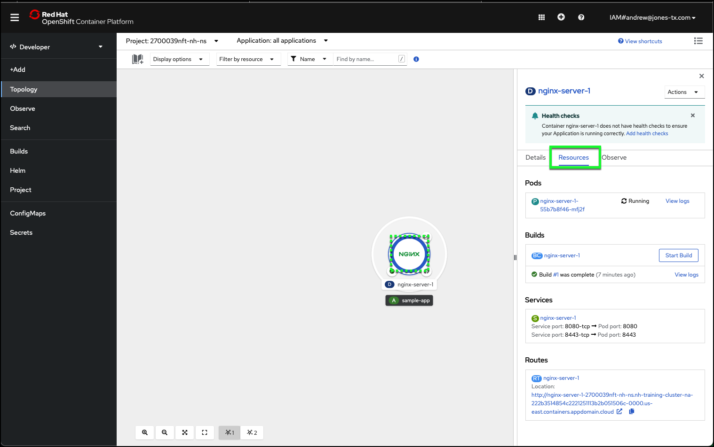
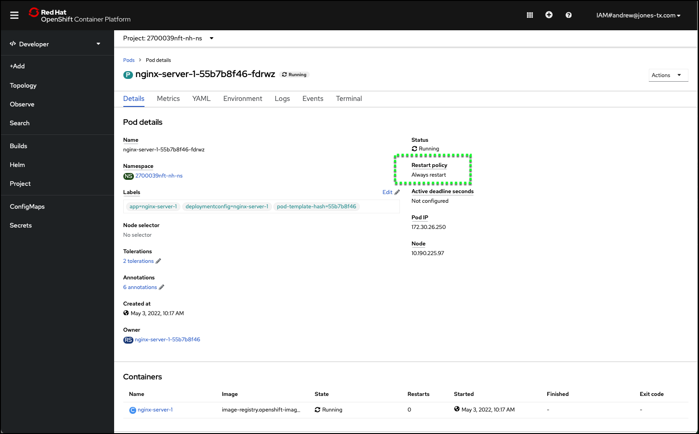

# Check deployment Status

The OpenShift web console provides valuable information about the status of everything running in the OpenShift cluster. In the next section, learn how to access some of the information about the NGINX container image you just deployed.

1. Return to the OpenShift web console tab/window of your web browser and select **Topology** from the left-hand taskbar.
2. Click the center of the deployment icon to display the deployment side bar containing the deployment details.

3. If not already selected, click the **Resources** tab in the deployment sidebar.

!!! success "Record this!"
    Record the **Service port** and **Pod Port** numbers displayed under the **Resources** tab.

4. From the displayed list of **Pods**, note how many containers have the **Running** status. You should see only one at this time.

OpenShift leverages the Kubernetes concept of a **pod**, which is one or more containers deployed together on one host, and is the smallest compute unit that can be defined, deployed, and managed.

!!! info "Learn more"
    You can learn more about the OpenShift and Kubernetes terms and concepts discussed in this lab. Check out these helpful sections of the OpenShift documentation:

    [Projects and Users](https://docs.openshift.com/online/pro/architecture/core_concepts/projects_and_users.html)

    [Containers and Images](https://docs.openshift.com/online/pro/architecture/core_concepts/containers_and_images.html)

    [Deployments](https://docs.openshift.com/online/pro/architecture/core_concepts/deployments.html)

    [Pods and Services](https://docs.openshift.com/online/pro/architecture/core_concepts/pods_and_services.html)

5. Take note of the pod **name**, then click on the **name** to view more details.
6. Scroll down the **Details** tab and record the **Restart Policy** for the pod.

!!! success "Record this!"
    Record the **Restart Policy** for your pod.

In the next section learn about OpenShift pod resiliency.
