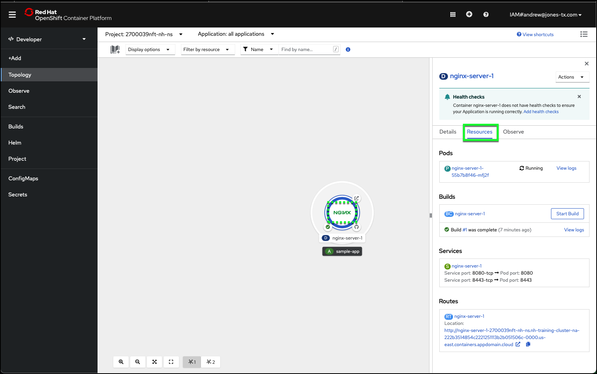
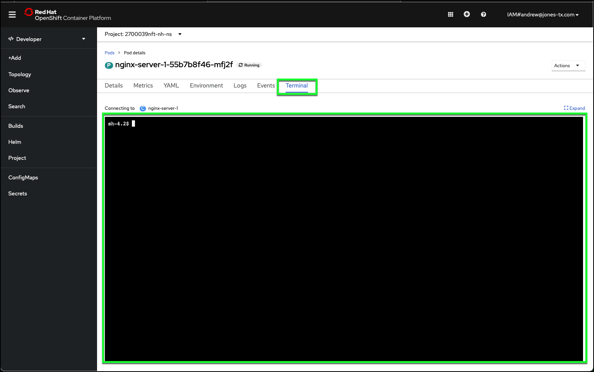

# Check deployment Status

The OpenShift web console provides valuable information about the status of everything running in the OpenShift cluster. In the next section, learn how to access some of the information about the NGINX container image you just deployed.

1. Return to the OpenShift web console tab/window of your web browser and select **Topology** from the left-hand taskbar.
2. Click the center of the deployment icon to display the deployment side bar containing the deployment details.


3. If not already selected, click the **Resources** tab in the deployment sidebar.



!!! success "Record this!"
    Record the **Service port** and **Pod Port** numbers displayed under the **Resources** tab.

4. From the displayed list of **Pods**, note how many containers have the **Running** status. You should see only one at this time.

OpenShift leverages the Kubernetes concept of a **pod**, which is one or more containers deployed together on one host, and is the smallest compute unit that can be defined, deployed, and managed.

!!! info "Learn more"
    You can learn more about the OpenShift and Kubernetes terms and concepts discussed in this lab. Check out these helpful sections of the OpenShift documentation:

    [Projects and Users](https://docs.openshift.com/online/pro/architecture/core_concepts/projects_and_users.html)

    [Containers and Images](https://docs.openshift.com/online/pro/architecture/core_concepts/containers_and_images.html)

    [Deployments](https://docs.openshift.com/online/pro/architecture/core_concepts/deployments.html)

    [Pods and Services](https://docs.openshift.com/online/pro/architecture/core_concepts/pods_and_services.html)

5. Take note of the pod **name**, then click on the name to view more details.


6. Scroll down the **Details** tab and record the **IP Addresss** and **Restart Policy** for the pod.

!!! success "Record this!"
    Record the **Restart Policy** for your pod.

7. Click the **Terminal** tab.



8. Click inside the **Terminal** window (black box with a prompt like **sh-4.2$**).

The **Terminal** window allows you to issue commands directly to the operating system that is running in the container you deployed using the NGINX image. This image is running a customized Linux operating system.

9. Discover the **hostname** of your NGINX server, by running the **hostname** command.

!!! tip
    To save time, use click the  icon in the sections below to copy the text to your clipboard and then paste the text into the web console.

```
hostname
```

??? example "Example output"
    sh-4.2$ hostname

    nginx-sample-869bf677b6-7wnzs

    sh-4.2$

10. Discover the **IP address** of the running container for your NGINX server, by running the **hostname -i** command.

```
hostname -i
```

??? example "Example output"
    sh-4.2$ hostname -i

    172.30.234.2

    sh-4.2$

Later in this lab you will deploy another NGINX web server and create a load balancer to distribute requests between the two web servers.  To make it easier to identify which web server is being access, change the content that is displayed when you access this server.

11. Issue the following commands in the **Terminal** to modify the web server's default page. You will first create a backup copy of the original file in case you want to revert back to it later.

```
cp index.html index.html.orig
echo NGINX Server 1 works! > index.html
ls
```

??? example "Example output"
    sh-4.2$ cp index.html index.html.orig

    sh-4.2$ echo NGINX Server 1 works! > index.html

    sh-4.2$ ls

    README.md  index.html  index.html.orig  nginx-start  openshift

    sh-4.2$


12. Click **Topology** in left-hand task bar of OpenShift web console.
13. Click the **Open URL** button on the edge of the deployment icon. This will launch as a new tab or window in your web browser. You should now see the default page for the web server displays the new message: **NGINX Server 1 works!**


In the next section learn about OpenShift pod resiliency.
