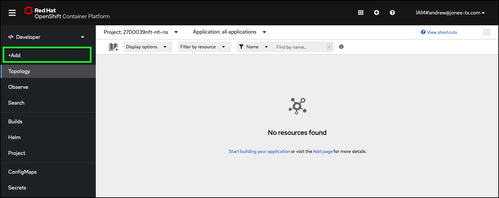
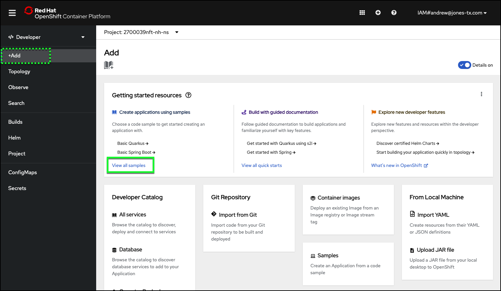
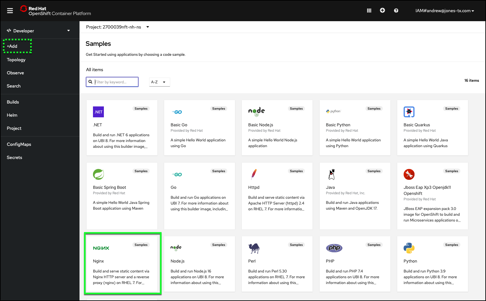
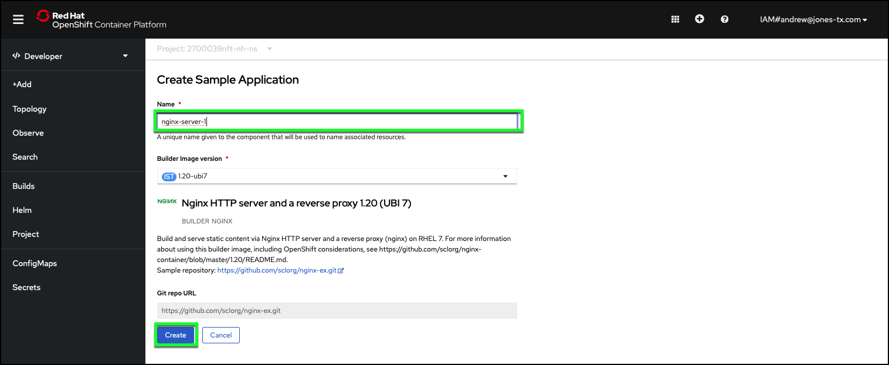
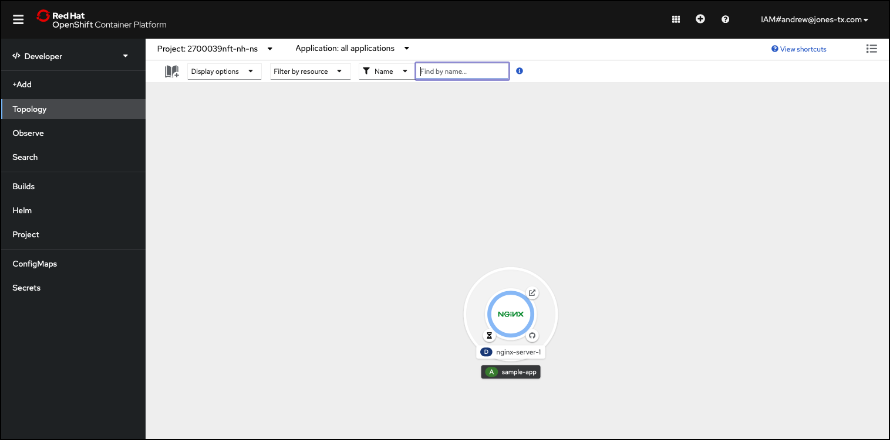
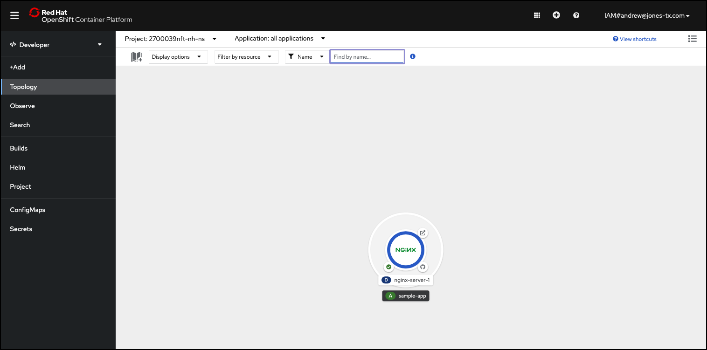
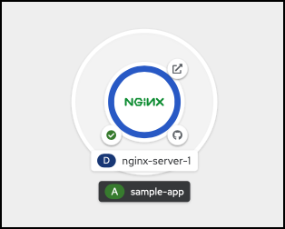

# Deploy a containerized application

Using the OpenShift web console you just opened in the [Getting Started section](gettingStarted.md), use the steps below to deploy an **application**. For this lab, the application is a **web server** that is running in a  container running the NGINX image.  NGINX is a free and open-source web server. You can learn more about [NGINX on Wikipedia](https://en.wikipedia.org/wiki/Nginx) and [here](https://www.nginx.com/).


1. Click **+Add** on the left-hand taskbar of the OpenShift web console.



2. Click the **View all samples** link on the **Getting started resources** tile.



3. Click the **NGINX** tile.

   The order of the tiles you see may vary from what is pictured below.



4. Change the **Name** field from _nginx-sample_ to _nginx-server-1_.
```
nginx-server-1
```



5. Click **Create**.



Your browser will refresh to the **Topology** view.  Notice the view now shows a NGINX deployment icon. The icon will cycle thru color changes as the container is created and the image is deployed. Wait for the outer circle to turn blue. Once the outer circle is blue, the container can be accessed.



6. Click the **Open URL** button on the edge of the deployment icon to open the default route created during the deployment. This will launch as a new tab or window in your web browser.



!!! Success "Record this!"
    Record the text displayed in the new browser tab/window after you click the **Open URL** button of the NGINX deployment icon. Note, you will need this information when completing the lab quiz!

Your NGINX web server is now alive and well.  Next, learn to scale and manipulate this containerized HTTP server.
