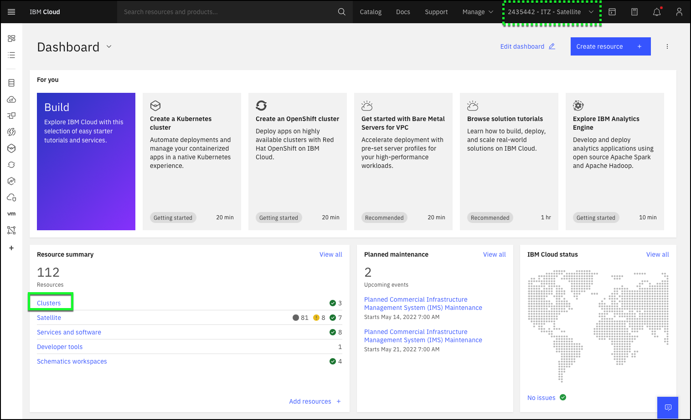
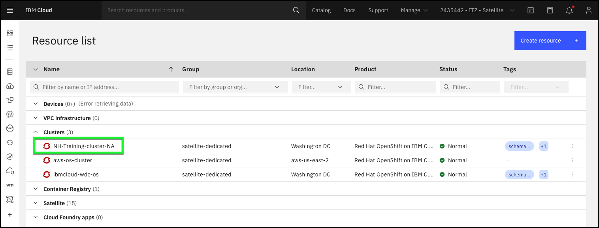
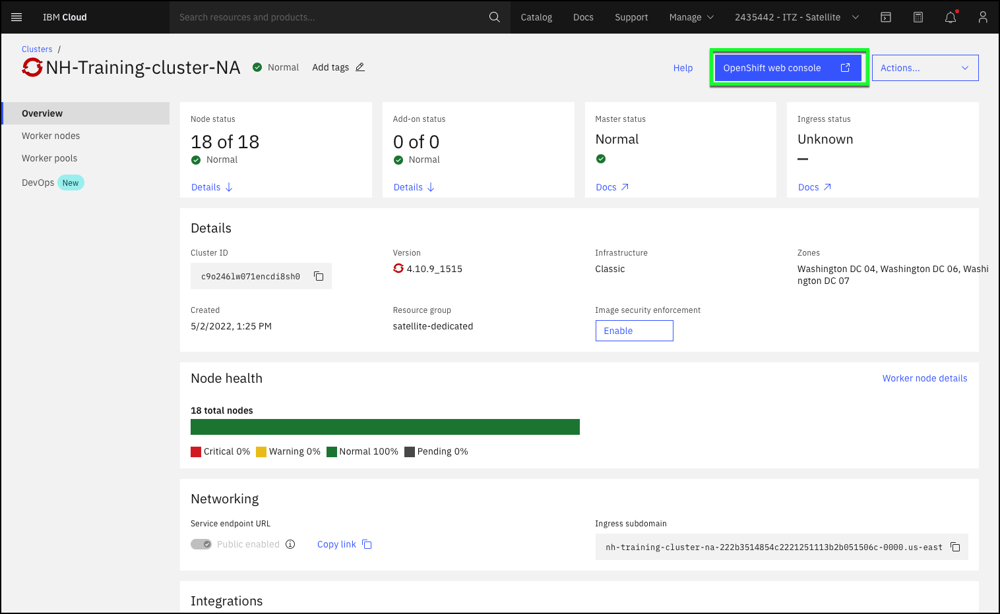
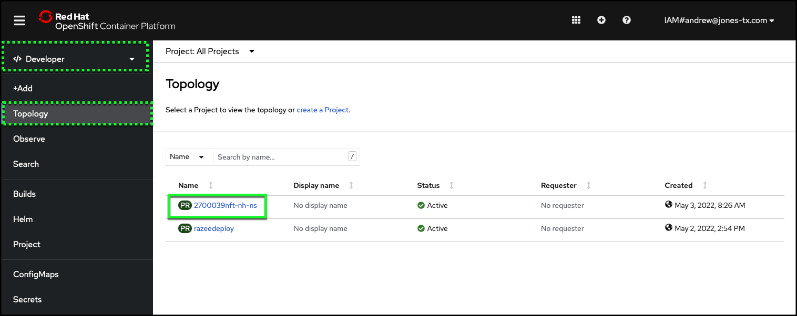
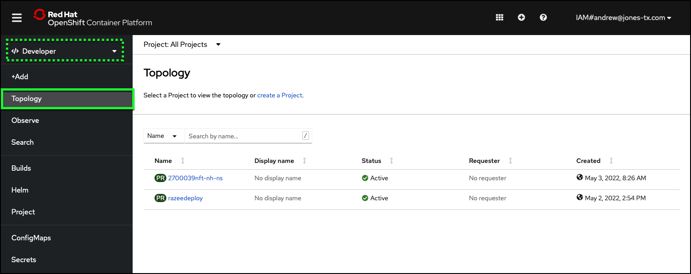

# Accessing the Red Hat OpenShift on IBM Cloud cluster

To get started, you will need to open the Red Hat OpenShift web console.  The easiest way to do this is to access it via the IBM Cloud portal.

1. Open a browser window/tab to [https://cloud.ibm.com](https://cloud.ibm.com).

2. Change from your IBM Cloud account to the lab account: **{{ account }}**

!!! tip
    If your browser window is narrow, you may see this icon:  instead of the current account name as shown in the screen capture above. If you do not see the {{ account }} listed, verify you accepted the invitation from IBM Cloud to join the account and that your IBM Technology Zone environment is active.

3. Click the **Clusters** link in the **Resource summary** tile.

4. Click the **{{ ibm.cluster_name }}** under the **Clusters** section of the **Resource list** table.

5. Explore the **{{ ibm.cluster_name }}** cluster details.

   Take a few minutes to explore the information and status about the OpenShift cluster you will be using. Notice the number of nodes in the cluster.  It is fairly large as this environment is used by everyone going thru the lab.  Clusters can be as small as 1 node.

6. Click the **OpenShift web console** button at top right.

   The OpenShift web console will open in a new browser window or tab depending on your browser settings. You should be directed to the **Topology** page in the **Developer** perspective as illustrated below.  If the top-left pulldown in left-hand taskbar says **Administrator**, click it and select **Developer** and then click the **Topology** menu item in left-hand taskbar.

7. Click the **Project** name that appeared in your ITZ reservation email.

   Projects, also know as namespaces, are similar to folders on your personal computer.  They allow you go group resources and provide access to individual users. As mentioned earlier, you are using a shared OpenShift cluster. While others are also using the cluster, you cannot see their projects, nor can they see yours.

Congratulations — you are now accessing the Red Hat OpenShift on IBM Cloud v4.X cluster. You’re ready to get to work.

Good luck!
