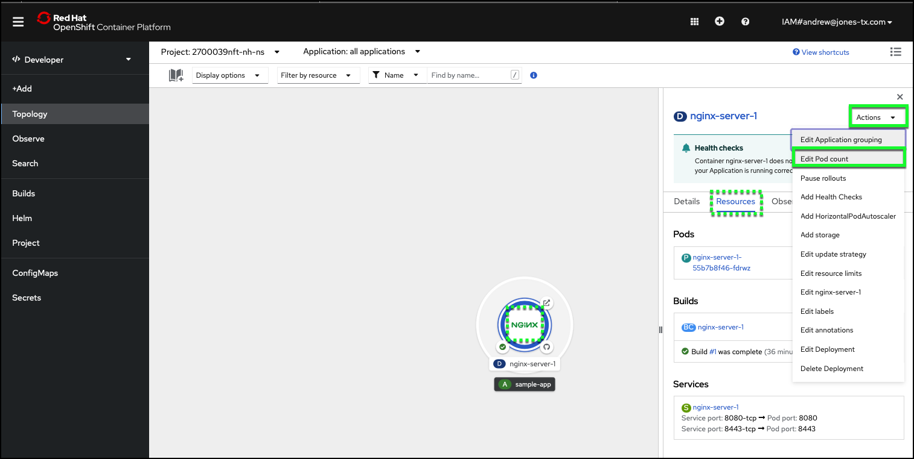
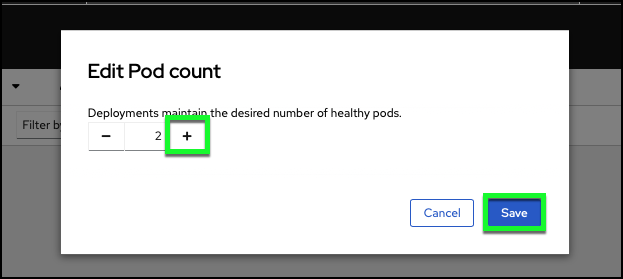
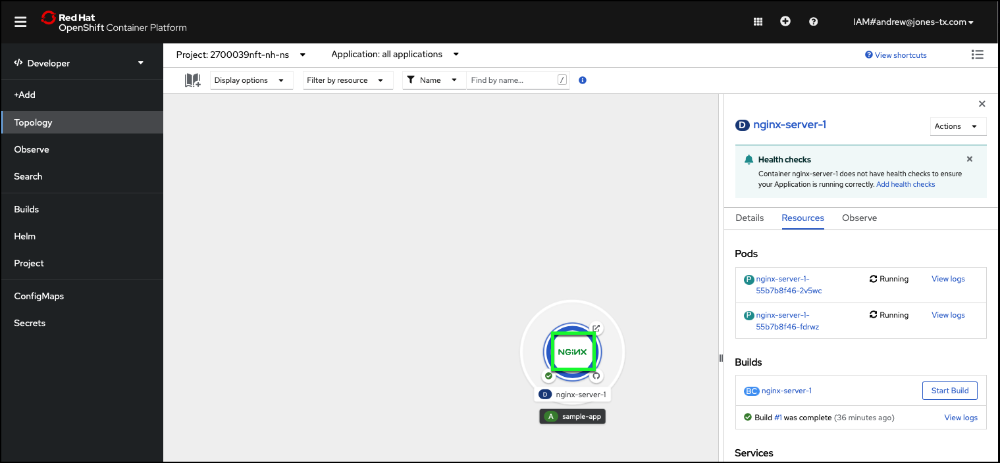
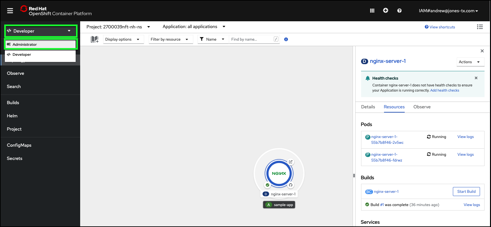
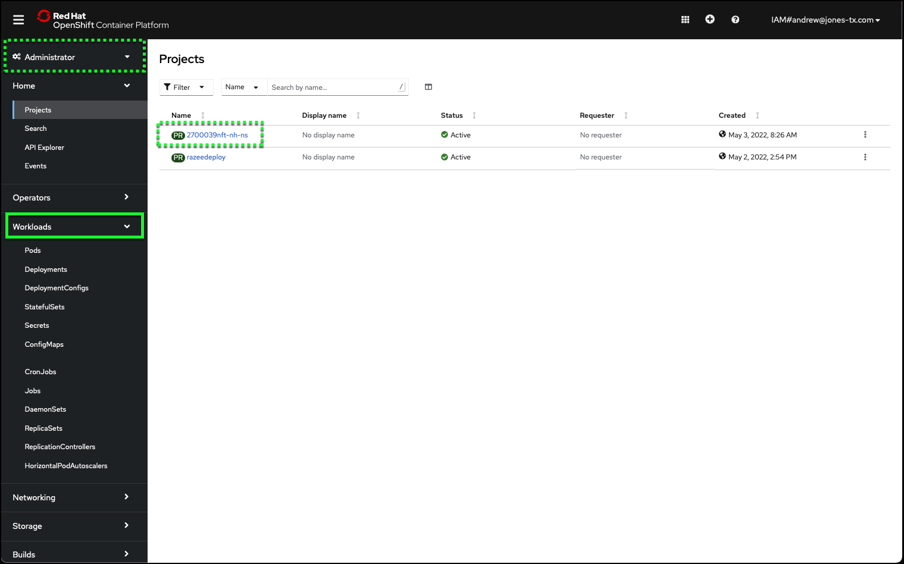
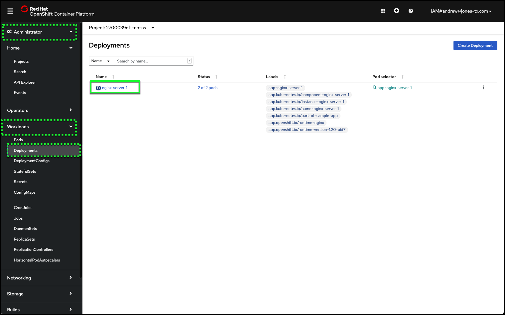
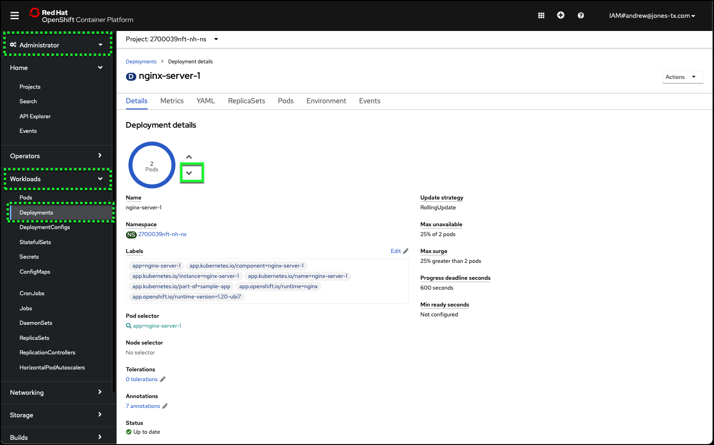

# Scaling deployments

In this section, scale the NGINX deployment to two pods and then back down to one. You will use both the the Developer and Administrator perspectives in the OpenShift web console.

1. From the **Topology** page, select the center of the deployment icon to once again display the side bar containing the deployment details.
2. Click the **Resources** tab.
3. From the Actions drop-down menu at the top-right of the page, click **Edit Pod count**.

4. Increase the pod count to _2_ by clicking the **+** button.

5. Click **Save**.

OpenShift will now start an additional pod using the same NGINX container image. The OpenShift web console will be updated dynamically as this process takes place.

6. Verify that the second pod has been started by viewing the **Pods** section of the **Deployment** **Resources** tab.

While the pod count could be scaled back down using the above process and changing the pod count from 2 to 1, lets explore how to do this using the **Administrator** perspective of the OpenShift web console.

7. Click the **Perspective** pull down menu and click **Administrator**.

8. Click the **Workloads** menu item in the left-hand taskbar.

9. Click **Deployments** in the sub-menu under **Workloads**.
10. Verify your project name is still selected at the top of the page next to the **Project** label.  If it is not, click the current **Project** name to open the projects pulldown menu and select your **Project** name.

11. Click the **nginx-server-1** deployment in the list of **Deployments**.
12. From the **Details** tab, scale down the pod count to 1 by clicking the **down arrow** next to the pod count circle.

Observe how the pod count circle changes. OpenShift immediately beings the process of scaling down the number of pods from 2 to 1. Before proceeding wait for the pod count to equal 1 and the outer ring returns to solid blue.

!!! question "Do you know the difference between deleting a pod and scaling down the number of pods?"
    When you **delete** a pod, you terminate the pod thus removing it from any additional network access. But by **scaling down** a deployment, the deployment remains active as resources and network access to the remaining pod(s) are still active.
