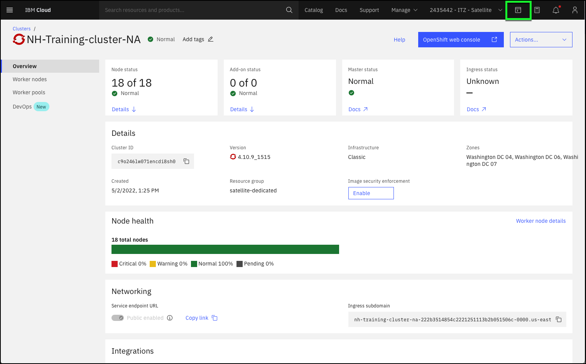
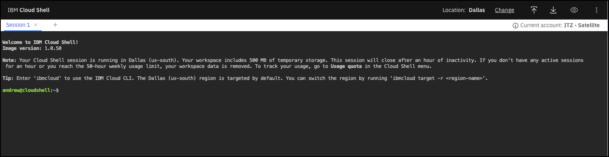
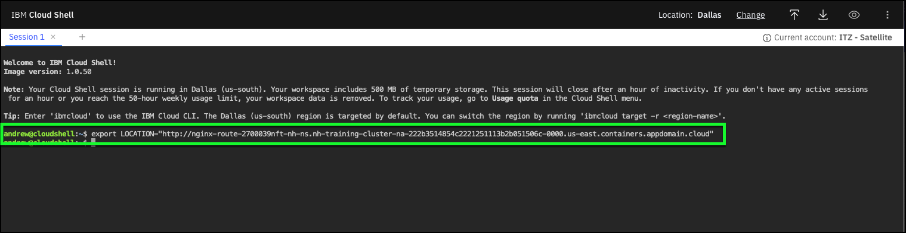
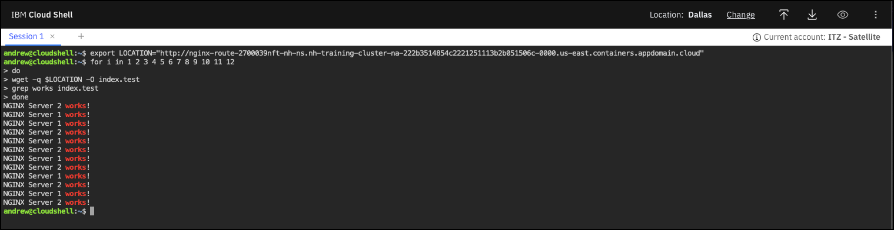

# Testing load balancing

Now that the route has been created to the two NGINX web servers, you will test the load balancing capabilities of the OpenShift platform by demonstrating how traffic can be distributed across our two containerized web servers.

To test the load balancer distribution, we will create an automated script to create a bunch of requests. In this part of the demonstration, you will use the IBM Cloud Shell. If you are not familiar with IBM Cloud Shell, you can learn about it [here](https://cloud.ibm.com/docs/cloud-shell?topic=cloud-shell-getting-started).

1. In the IBM Cloud Portal, with the demonstration account selected (**{{ account }}**), click the IBM Cloud Shell icon.



   The IBM Cloud Shell will open in a new browser tab or window. It may take a few seconds for the shell to initialize.



2. Create an shell environment variable with the **Location** URL you saved in the last section. At the **Cloud Shell** enter the following command substituting the **"URL"** with your **Location** URL.

```
export LOCATION="URL"
```



3. Copy and paste the script below into the IBM Cloud Shell and press **enter**.

```
for i in 1 2 3 4 5 6 7 8 9 10 11 12
do
wget -q $LOCATION -O index.test
grep works index.test
done
```



Remember to substitute the **Location** URL with the one you recorded in the last step of [Balancing network traffic](balancingNetworkTraffic.md). Take note of how the application routing is balanced equally (50:50) between _nginx-server-1_ and _nginx-server-2_ according to the route definition created earlier!

!!! success "Record this!"
    Record the script's output. How many times is **NGINX Server 1 works!** and **NGINX Server 2 works!** printed to the screen?

You know have an application that is deployed across multiple servers and load balanced to distribute incoming requests between the deployed servers.
