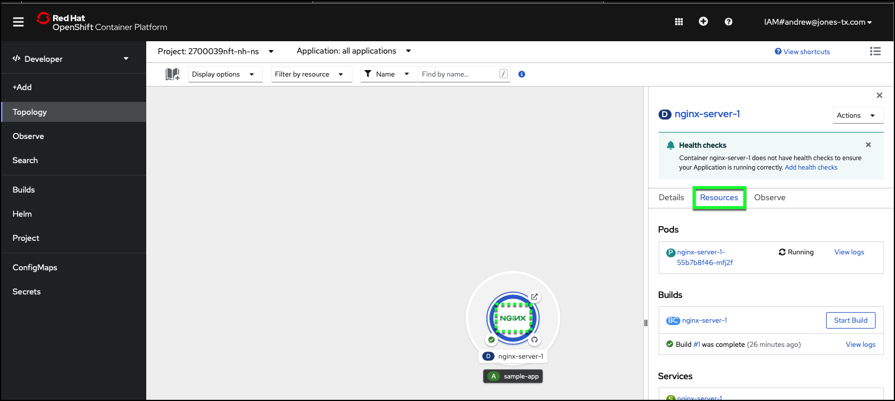
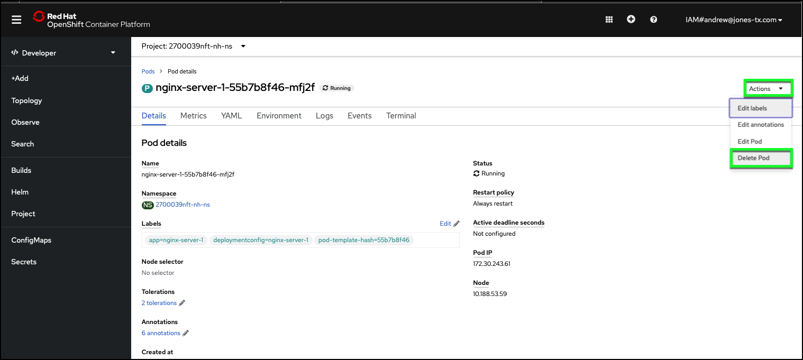
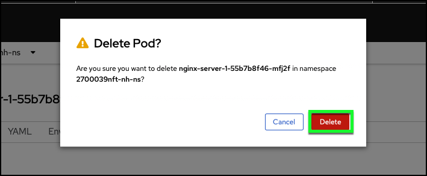

# Testing resiliency

In the previous section, you discovered that the pod restart policy for your deployment was set to **Always Restart**. In this section we will test the resiliency of the deployment and its policies.

1. Return to the pod details page: click the center of the deployment icon on the **Topology** view of the web console.
2. Click the **pod** name link.

3. To simulate a pod failure, terminate the pod. From the Actions menu, click **Delete Pod**.

!!! note
    In the next step, you will confirm the deletion.  When you do so, the OpenShift web console will reload with a view of all pods.  To better view the deletion and the restart policy in action, immediately after confirming the deletion, click **Topology** in the left-hand taskbar and watch the NGINX deployment icon.

4. Confirm the action by clicking **Delete**.

You should notice the deployment icon change from a solid blue outer ring to a segmented black and light blue ring. Wait for the pod to restart (single blue outer ring).

5. Return to the Pod Details tab by clicking on center of NGINX deployment icon. Observe the name of the pod. Does it match the previous Pod’s ID?

In the next section learn how to you can access and update your containerized application.
