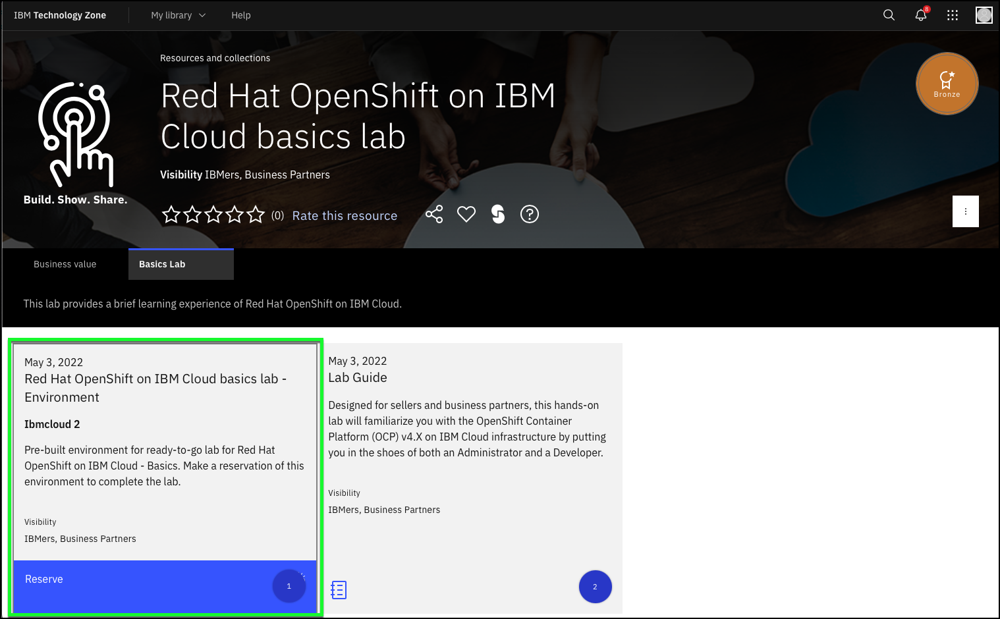
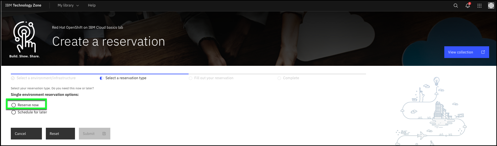
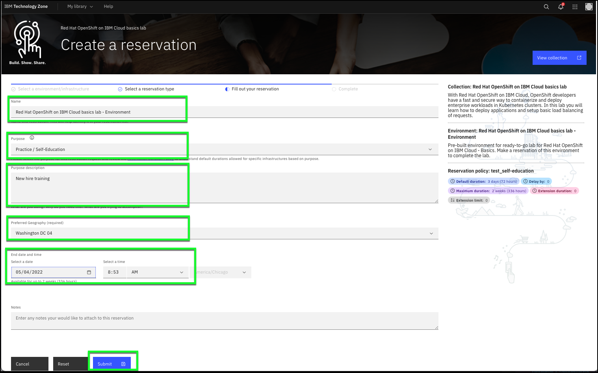
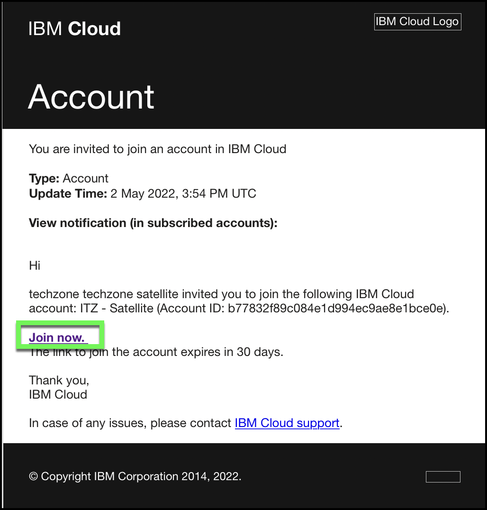

# What you will need

Please ensure you’ve prepared and reviewed the following before embarking on this lab. If you haven't already, sign up for an IBMID on IBM Cloud (this will be linked with your w3ID if you are an IBMer): [https://cloud.ibm.com](https://cloud.ibm.com)

This lab uses a pre-configured Red Hat OpenShift on IBM Cloud cluster that is shared amongst others completing the lab. The environment is provided through IBM Technology Zone. Follow the directions below to create a reservation and receive access to the environment.


1. Navigate to the IBM Technology Zone (ITZ) collection for this lab: [https://techzone.ibm.com/collection/roks-basics-lab#tab-1](https://techzone.ibm.com/collection/roks-basics-lab#tab-1)

2. Click **Reserve**.



3. Click the **Reserve now** radio button.



4. Complete the following fields for the reservation:

   Name: ```Red Hat OpenShift on IBM Cloud basics lab - Environment```
   Purpose: **Practice / Self-Education**
   Purpose description: ```New hire training```
   Geography: **Washington DC 04***

!!! tip "Geography"
    If multiple selections are available in the Geography pulldown menu, either select the geography nearest you or the geography specified by your instructor if you are using this lab for a class.

5. Specify an **end date** and **end time**.

   While this lab will only take approximately 90 minutes to complete, you may want to reserve it for a longer period of time.  Please keep in mind this lab utilizes shared resources, so please be considerate of others and only reserve for the time you anticipate needing it or delete the reservation via the ITZ portal.



6. Click **Submit**.

Once your reservation has been submitted, it will take a few minutes (typically under 10) for it to be processed. During this time, you will likely receive at least 3 emails. The first will be an email confirming the reservation request and that it is in process.  The second email will arrive once your reservation is complete and the environment is ready for use. It is **critical** that you read this email and record **namespace** you have been assigned.  You will find this in the body of the email and it will look something like:

**Namespace: 1234567abc-nh-ns**

You will use this information later in the lab guide.

The 3rd email you receive will be an invitation to join an IBM Cloud account.  It is **critical** that you accept the invitation by following the instructions and link provided in the email.



Once you have completed the above steps, you are ready to proceed to the lab.
